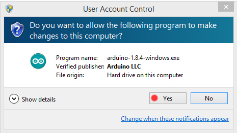
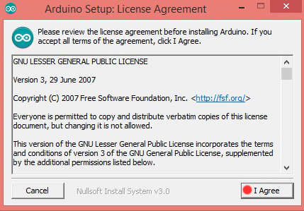
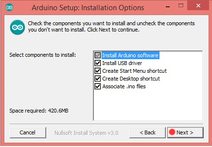
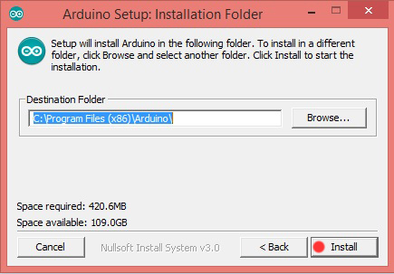
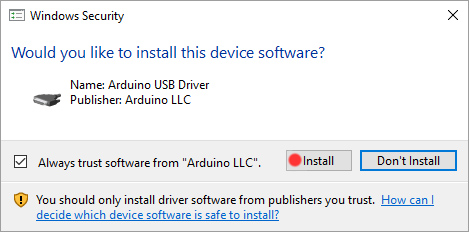

 # 
 WHO SAYS MECHANICAL CAN'T DO AUTOMATION ?
# 
...Hai...
# 
Welcome to Mechatronics 
##  What is mechatronics :question:

### The integration of ***mechanical engineering*** with *electronics* and *intelligent computer control*.

## But why :question:

### Well, its all about *multi-disciplinary skills* and creating  _smart machines_ that are aware of their surroundings and can make decisions.

#### Tell me more ! :point_down:
It can be viewed as '**modern mechanical engineering design**' in the sense that the design of the mechanical system must be performed together with that of the electrical/electronic and computer control aspects that will comprise the complete system.

#### Can we have some examples :question:

A **robot** is a good example of a mechatronic system.
 Most robots integrate software, electronics, and mechanical designs in a synergistic manner
#### WAIT what is synergy :question:

meaning that the separate parts act together in such a way that the combined effect is stronger than the sum of the separate effects of each one of the components

#### Other examples :question:
 Other examples of mechatronics are the **digital thermostat** and the **anti-lock brake system.** Both were originally designed as mechanical systems and have been improved later by their integration with electronic controls and digital computing elements.

###  OK! Thats enough theory let's start building robots.

###  OHH wait! we got to know about Arduino!!!

###  What is Arduino:question:

### Arduino is an *open-source* electronics platform based on easy-to-use hardware and software.

Thanks to its simple and accessible user experience, Arduino has been used in thousands of different projects and applications.
 The Arduino software is easy-to-use for beginners, yet flexible enough for advanced users. It runs on Mac, Windows, and Linux

[click! To know more about ARDUINO](https://www.arduino.cc/en/Guide/Introduction)

[click! Arduino HOME PAGE](https://www.arduino.cc/)

### Commonly used hardware 

###  How do we install arduinoIDE:question:

* [click! To download the software (windows)](https://www.arduino.cc/en/Main/Donate)

* follow the red dot to finish installation 

 

 

 

 

 

###  How do we initialise Arduino UNO?

* [click! initialise](https://github.com/inventivecentral/MeX/blob/master/initialize.md)

